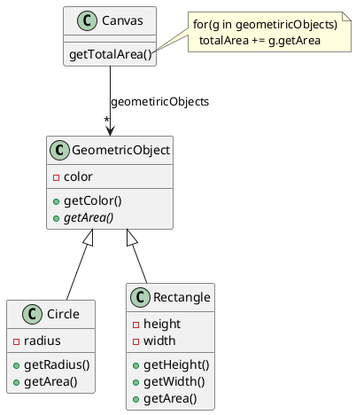

# Lab 8
## Step 1

课本练习8.7的要求如下

Finds two points in a two-dimensional space nearest to each other. Use a two-dimensional array to represent the points. Test the program using the following points:
```java
double[][] points = {{−1, 0}, {−1, −1}, {4, 1}, {2, 0.5}, {3.5, 2}, {3, 1.5}, {−1.5, 4}, {5.5, 4}};
```

8.7要求用一个多维的数据来表示一个点的列表，这并不是一个很好的抽象。请用java的基于类的抽象、封装的方法重新设计，并将其命名为`Point.java`。

注意：如果有多个对象距离最近，返回第一个，下同。

相关代码写在package lab8.step1中

  样例输入
  ```
  {−1, 0}
  {−1, −1}
  {4, 1}
  {2, 0.5}
  {3.5, 2}
  {3, 1.5}
  {−1.5, 4}
  {5.5, 4}
  END
  ```

  样例输出
  ```
  {-1, -1}
  {-1, 0}
  {3.5, 2}
  {3, 1.5}
  {3, 1.5}
  {3.5, 2}
  {-1, 0}
  {3.5, 2}
  ```

## Step 2

获取形状之间的最短距离

本lab素材中的lab8.step2中提供了一组java类，具有如下结构

利用继承和多态改造这组java类以实现Canvas类中下面增加的方法：
```java
//获取canvas中距离指定几何对象最近的对象
public GeometricObject getNearestObjectOf(GeometricObject obj)
```

使得使用该方法能够得到Canvas中距离指定几何对象最近的对象。简化起见，圆形和矩形的距离定义均为其形状的中心点的距离。

注意：需要忽略掉*相同*的对象。

相关代码写在`package lab8.step2`中，尽可能复用step1的结果，必要时复制step1的代码至step2。

用于测试样例的程序，要将输入的图形序列代表的，平面直角坐标系中的所有图形存储，圆形的输入序列为`C xaxis yaxis radius`，矩形的输入序列为`R xaxis yaxis height width`，并在`END`表征的输入结束后，输出所有输入图形的最近邻的图形

（此处可直接调用 `System.out.println(GeometricObject)` ，因为circle对象与Rectangle对象均重写了`toString`方法）

注意，圆形的坐标成员是圆心的坐标`(xaxis, yaxis)`，半径为`radius`，矩形的坐标成员是左下角端点的坐标`(xaxis, yaxis)`，矩形的长宽严格平行于坐标轴方向，并约定输入的矩形沿x轴方向的边为成员`width`，沿y轴方向的边为成员`height`。

  样例输入
  ```
  C 1 1 2
  R 2 2 8 10
  R 2 2.5 1 1
  C 3 3 9
  END
  ```

  样例输出
  ```
  R 2 2.5 1 1
  C 3 3 9
  C 3 3 9
  R 2 2.5 1 1
  ```

## Step 3

上述代码中，getNearestObjectOf有可能会没有符合条件的结果。请思考此时应该如何设计这种异常的机制。需要考虑有哪些方式，并进行比较，之后会在课上进行讨论。提交PDF格式的文字说明。命名为`step3.pdf`

本次任务书的Markdown源码已经开放，大家可以对照学习一下课上讲的UML类图的绘制方法。例如，使用VS Code的同学，安装`PlantUML`插件之后，**在插件的设置中（打开插件界面后插件图标旁边的齿轮），指定PantUML.server为`https://www.plantuml.com/plantuml`**，就可以显示类图，安装`Markdown All in One`插件之后就可以完整导出包含类图的markdown文档。

## 提交要求

提交的压缩包目录结构如下：
```
`--lab8
   `--src
      `--main
        `--java
            `--lab8/
              |--step3.pdf
              |--step1/
              |   |--Point.java
              |   `--*.java
              `--step2/
                  |--Canvas.java
                  |--GeometricObject.java
                  |--Circle.java
                  |--Rectangle.java
                  `--*.java
```